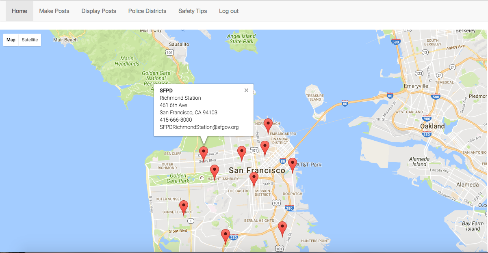

<h1>LOVE THY NEIGHBORHOOD</h1>

Love Thy Neighborhood gives users access to a variety of neighborhood events that are occurring in their neighborhood. This web application allows users to upload comments and post photos about their neighborhood. As users view the posts, they are able to sort by date, crime or community event. As additional resources, users are able to locate their local police stations and view a list of personal safety tips.

<h2>Police Station Map</h2>

<h2>Wall Post Page</h2>

<h3>Tech Stack:</h3> Javascript, Python, Flask, Jinja, PostgreSQL, SQL Alchemy, HTML, CSS, Bootstrap
